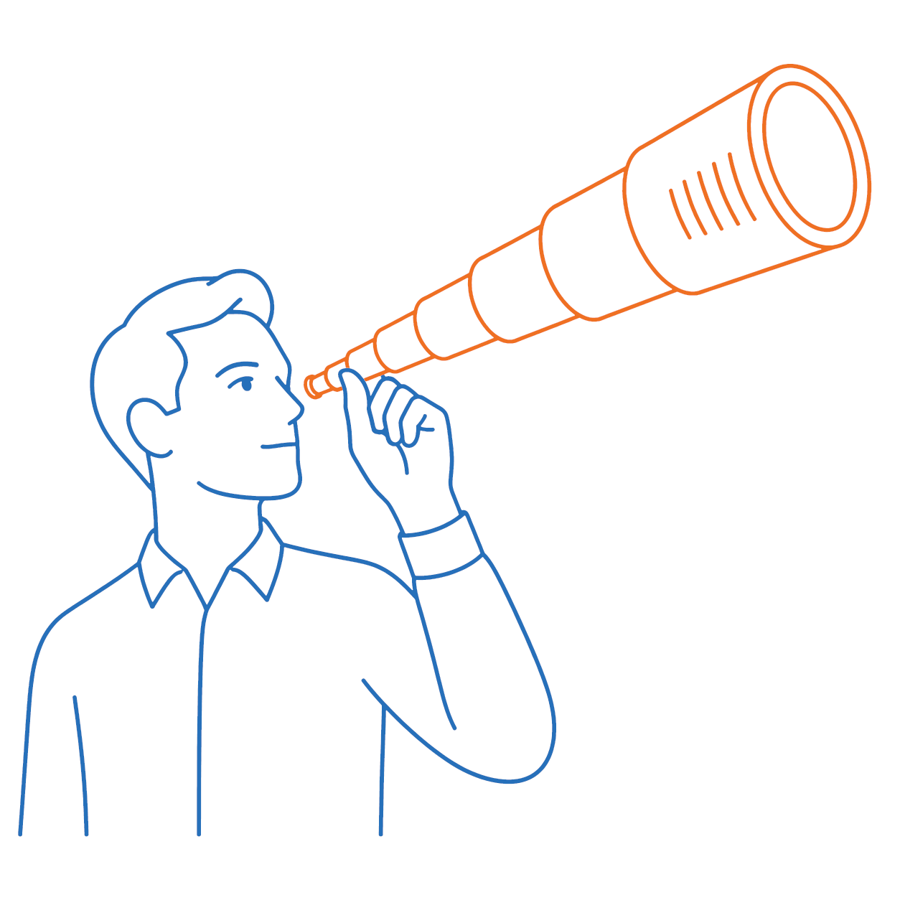

Telescopic engineering
======================



**Problem:** AI provides code fast, at a cost of grave loss of control.

**Solution:** restore control through a chain of progressively detailed documents, from README to code.

You've just read the shortest pitch. You can read the next "telescopic engineering" stage below or skip to [motivation](10_motivation.md) or go straight to [full details](20_detailed_description.md).

What you get
------------

No more drowning you with take-it-or-leave-it generated content. No more too big `agent.md` file that consumes precious context.

**Right roles for each party.** AI does what it's good at (controlled expansion from short blurbs, consistency checks, propagation across documents). Humans stay in charge of what they do well (big picture, writing and proofreading short extracts, judgment calls).

**Freedom to rebuild.** Because each upstream document is self-contained, any downstream stage could even be regenerated, in part or in full — rewriting some code from unchanged implementation docs and tests, re-architecting from an unchanged functional spec, even pivoting the technology stack while preserving the functional specification.

See [motivation](10_motivation.md) for the full argument.

What it is
----------

Telescopic engineering defines:

- a chain of stages, each a refinement of the previous one

``` default
README.md
  -> capability spec
     -> functional spec
        -> architecture
           -> implementation
              -> code
```

- and some rules about where AI is used to perform steps that are traditionally costly for humans (e.g. controlling consistency, carefully propagating changes) and where AI stops to let humans do what they are good at.

- a CLI skill (`/telescopic`) to guide and automate applying the method: audit docs against the method's rules, propose concrete improvements, and drive implementation with human review at each step.

That's where the skill amplifies the method. Rather than drowning you in generated content, the AI is now guided by documents that stay aligned: you review short passages from the shortest applicable stage to confirm they match your intent, if needed edit them, and the AI propagates the changes in any direction needed, under your control.

When each party does what they are best at, you get the smoothest experience and achieve your goals.

See [full details](20_detailed_description.md) for the stage-by-stage breakdown, and the [FAQ](30_faq.md) for common questions.

Name origin
-----------

Like a pocket telescope that extends in nested segments, the method extends a project as a chain of documents, each segment revealing more detail without disturbing the alignment of the whole.

Status
------

The method itself looks sound: it has already delivered useful results in a few projects. The accompanying `/telescopic` skill was only tested in a few cases and will most certainly need some hints in practice until refined. Overall, the project is useful and bound to keep improving.

Navigation
----------

See [motivation](10_motivation.md) for the full argument, [how it works](20_detailed_description.md) for the stage-by-stage breakdown, and the [FAQ](30_faq.md) for common questions.
